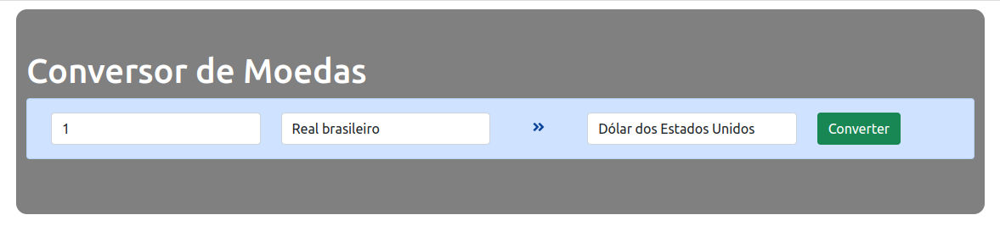

  <h1>Conversor de Moedas</h1>

  

Conversor de moedas desenvolvido em ReactJS utilizando também a API do [fixer io](https://fixer.io/)

<pre>
{
  "base": USD,
  "date": "2022-10-19",
  "rates": {
     "CAD": 1.260046,
     "CHF": 0.933058,
     "EUR": 0.806942,
     "GBP": 0.719154,
     [170 world currencies]
  }
}
</pre>

## ✔️ Técnicas e tecnologias utilizadas

Lista de tecnologias que foram usadas nesse projeto:

## 🛠️ Abrir e rodar o projeto

Para abrir e rodar o projeto, entre na pasta do frontend execute npm i para instalar as dependências e npm run dev para iniciar o projeto.

Depois, acesse <a href="http://localhost:3000/">http://localhost:3000/</a> no seu navegador.

## 📚 Mais informações

Entre em contato pelo [linkedin](https://www.linkedin.com/in/grazziano-fagundes/).

  <small>Grazziano Borges Fagundes - 2022</small>

